## Grab My Courses Reactjs Frontend (https://grabmycourses.com/)

### Grab My Courses is a utility that has been created to help students get the courses they are looking for in their school. 

## Problem statement:
##### Lots of schools have limited courses and each course also sometimes has limited seats itself. This leaves many students ending up taking courses they are not really interested in. That is the problem I wanted to solve.
##### The major features offered by this utility are:
##### 	1. It notifies students when there is an open seat in the course of their interest.
##### 	2. It provides a platform to help students swap/exchange their courses with fellow classmates.

## Tech stack used:
##### The frontend of this webapp has been implemented using Reactjs framework. Major libraries that have been used include react-bootstrap, redux and axios etc.

## Presentation:
##### Following are some of the demo images for the public code presented as part of this repo:
- Website home
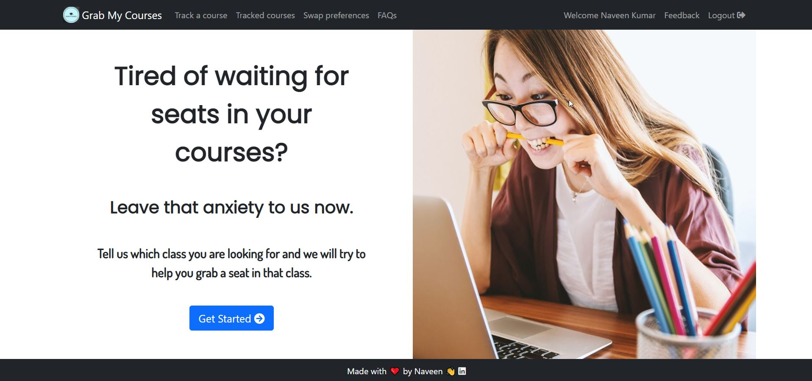

- Register
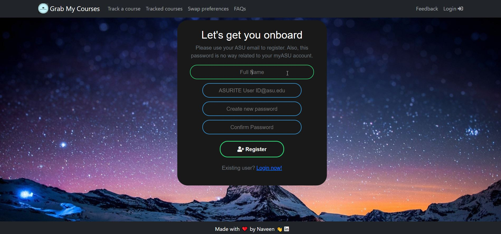

- Login
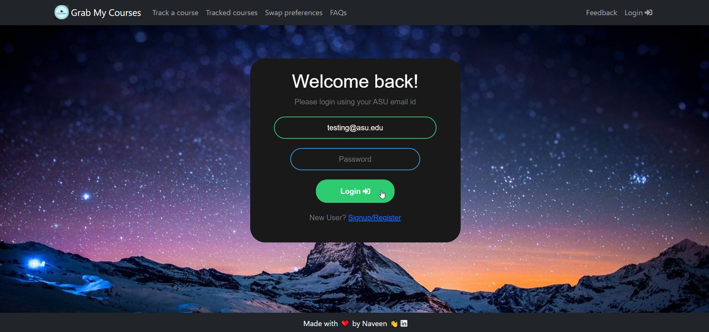

- Search Courses
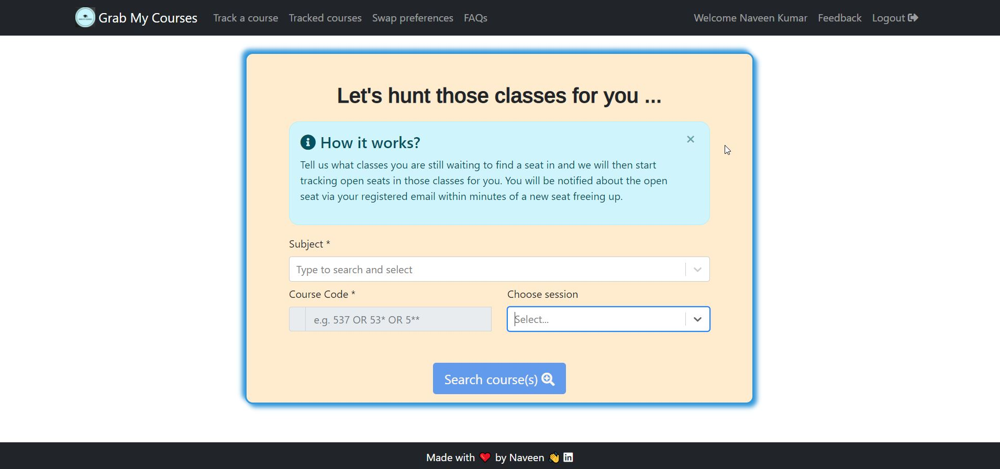

- Course search results
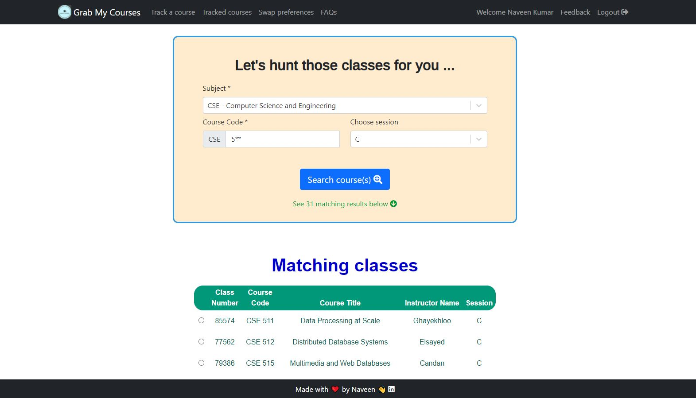

- Track a course
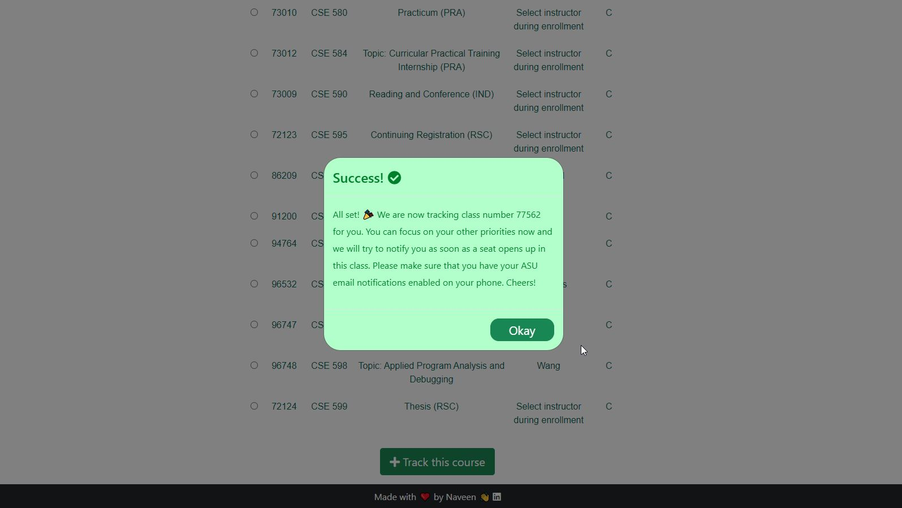

- View tracked courses
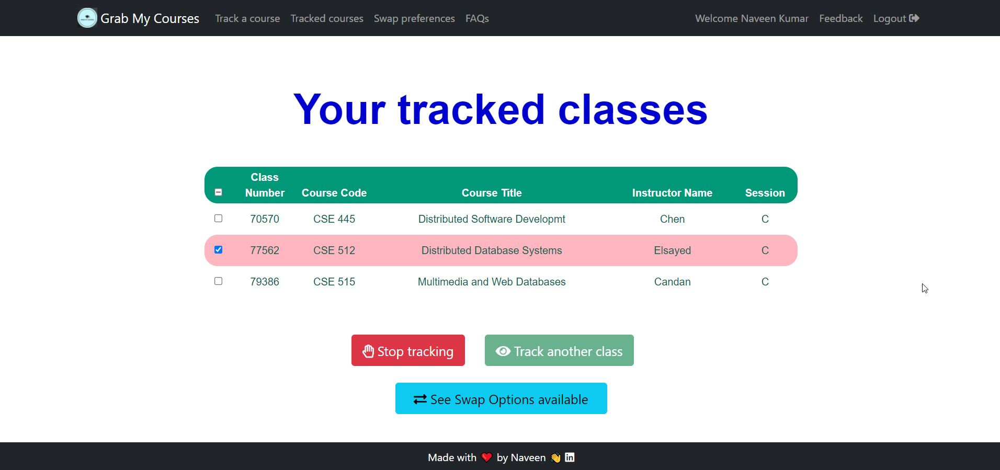

- Course Swap/Exchange options
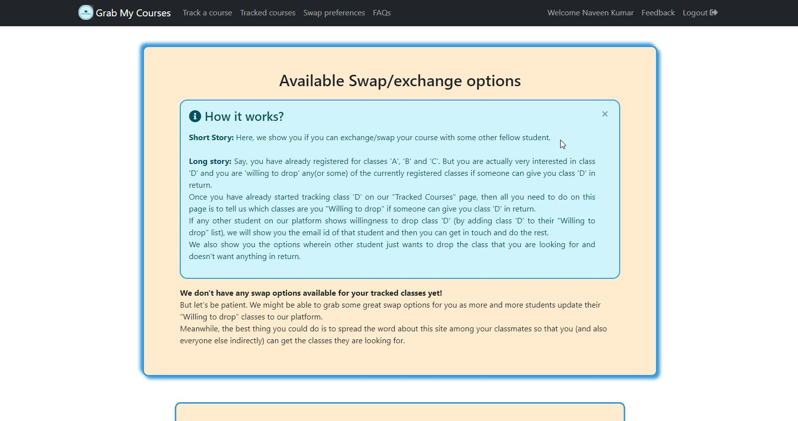
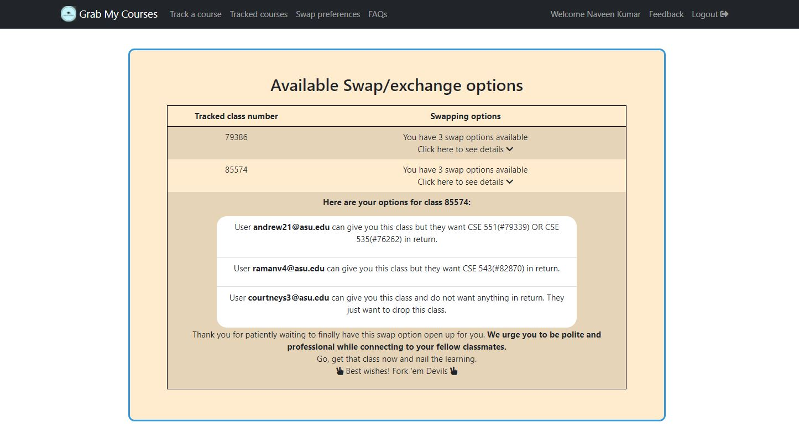
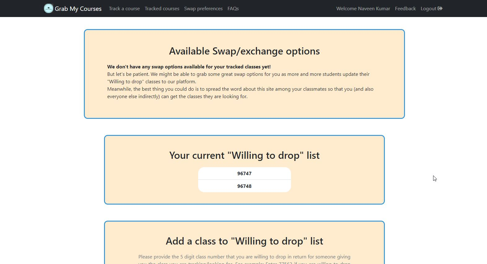
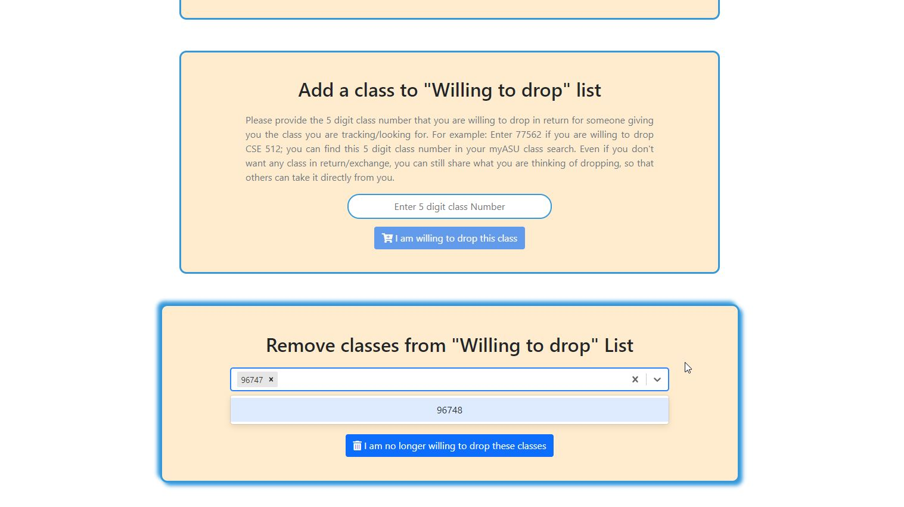
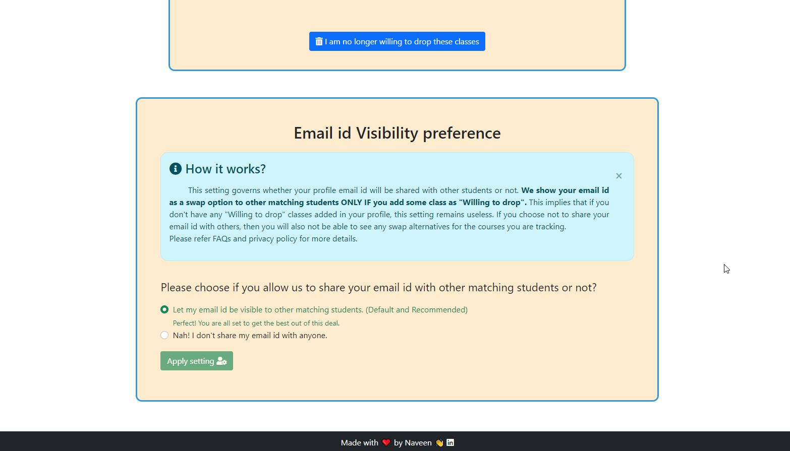

- FAQs
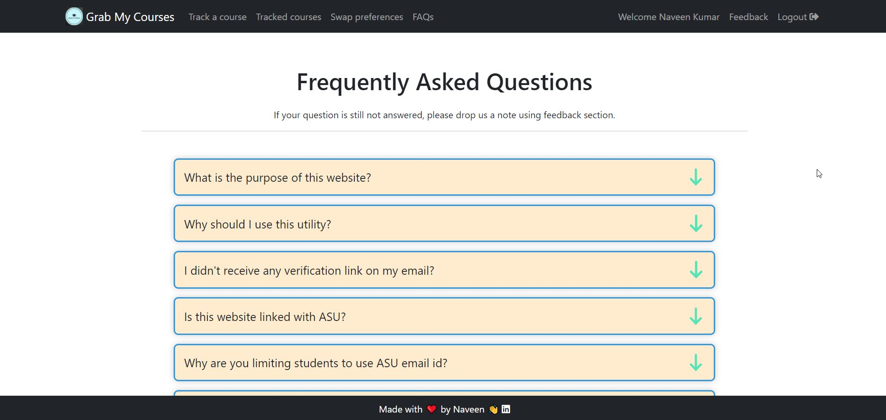

- Feedback
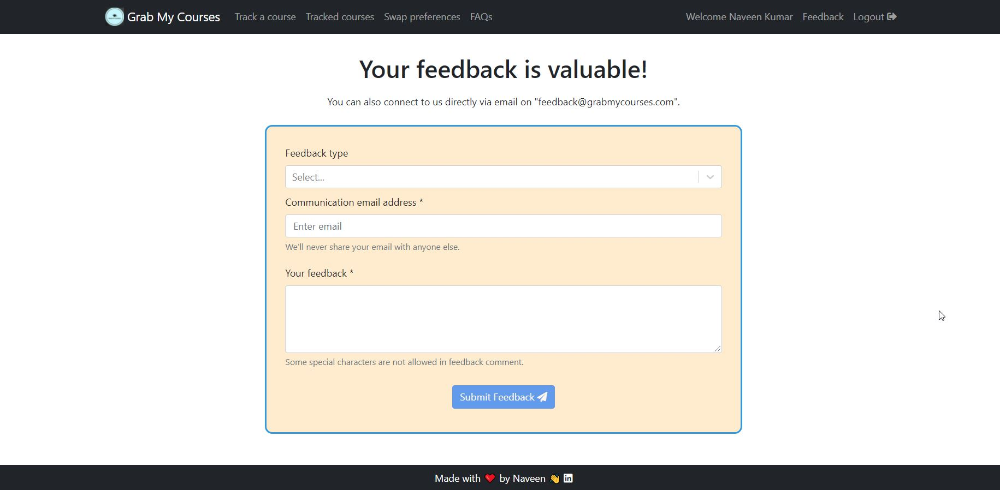

#### Currently this utility is publically available for Arizona State University alone but I am working to add more schools gradually.

